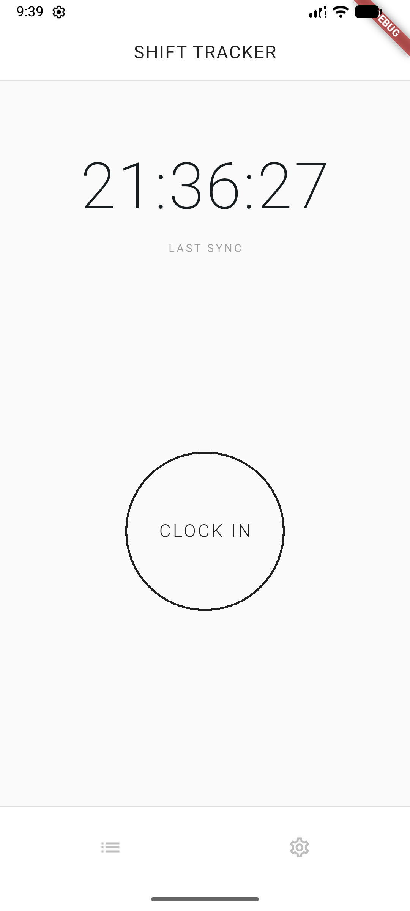
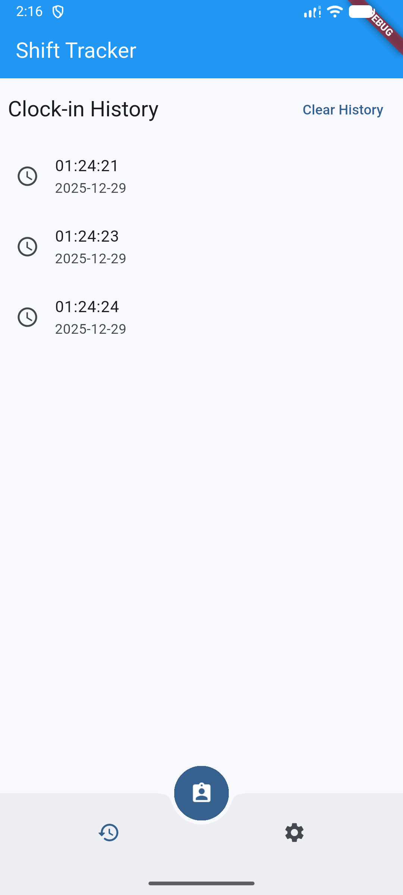
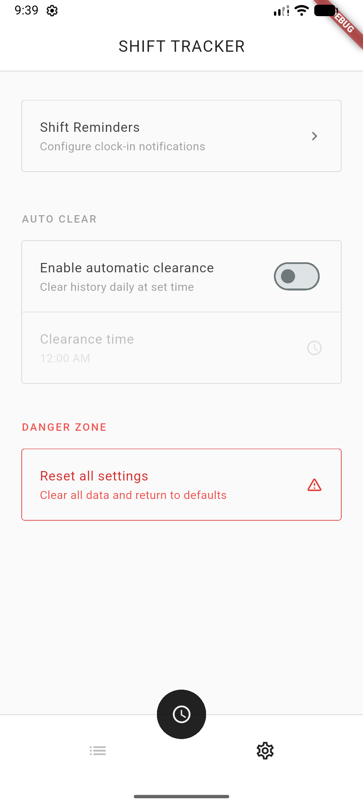

# Shift Tracker App

Created to mimic a "work clock-in app"

## Screenshots

  
Clock In

   
  

  
History

   
  

  
Settings

   
  

## Libraries Used

This project makes use of the following Flutter packages:

- **cupertino_icons**: Provides the default set of icon assets used by Cupertino widgets (iOS style).
- **http**: Future-based library for making HTTP requests.
- **intl**: Provides internationalization and localization facilities, including date formatting and parsing.
- **connectivity_plus**: Used to retrieve the current network connectivity status (WiFi, Mobile, None, etc.).
- **shared_preferences**: Wraps platform-specific persistent storage for simple data (UserDefaults on iOS and macOS, SharedPreferences on Android, etc.).
